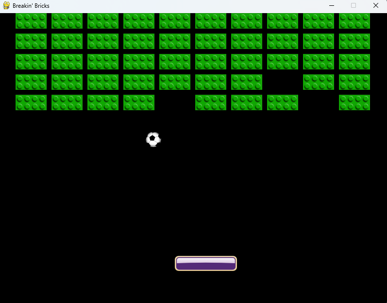

# Breaking Bricks Game with Python

This game is built with Python using the Pygame library.

## Gameplay

In this game, your objective is to destroy all the bricks on the screen by bouncing a ball off a paddle. You control the paddle's horizontal movement with the left and right arrow keys. Use the spacebar to serve the ball and start the game.



## Controls

- Spacebar: Serve the game
- Left Arrow Key: Move the paddle to the left
- Right Arrow Key: Move the paddle to the right

## Installation

1. Clone this repository to your local machine:

```bash
 git clone https://github.com/Matheus-OAMK/Breaking-Bricks-Pyhon-Game.git
```

2. Install the required packages using pip:

```bash
 pip install -r requirements.txt
```

3. Run the game with the following command:

```bash
 python main.py
```
